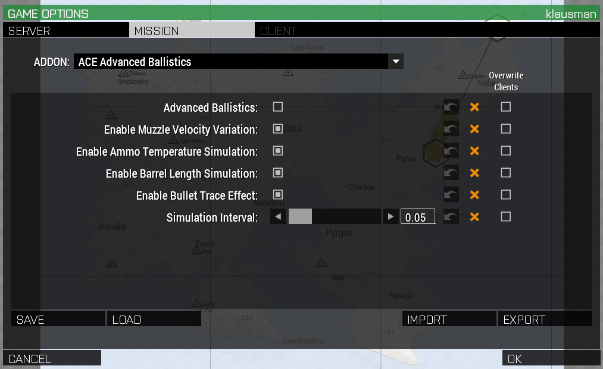

CBA Settings are the de facto standard for managing addon settings in Arma3.
They have completely replaced Editor-side modules and other ways to manage
mission- or server-wide settings. One last holdout of non-CBA settings is RHS,
but those settings are entirely client-side and thus not relevant here.

## Who overrides what, then?

With a game like Arma, settings can basically fall into three categories:

- Settings that are set by the server and can be changed by neither the
  mission nor the client
- Settings that have a default on the server, but the mission maker can change
  them. Yet, the client has no say.
- Settings that both the server and the mission can specify (possibly
  differing) values for, but the client can override both.

CBA Settings allows these three cases (and a few small sub-cases) to be managed
by using the `force` prefix once or twice per setting (or not at all),
resulting in this precedence of settings:

```
On Server No Force:
    On Mission No Force:
        Client > Mission > Server
    On Mission Force:
        Mission > Client > Server

On Server 1 Force:
    On Mission No Force:
        Server > Client > Mission
    On Mission Force:
        Mission > Server > Client

On Server 2 Force:
    Server > All
```

(from https://github.com/CBATeam/CBA_A3/wiki/CBA-Settings-System which is
recommended reading if you want to dive deeper)

For the most part, you won't have to worry about the "force force" syntax.
Using the CBA settings UI in the editor is preferable.


## For mission makers

One of the issues that has come up is that with a new ACE version, using old
mission templates will not fill in any of the new settings, thus making them
the default. Many settings are *not* overridden by our server, so the mission
enforces the ACE default, which is often not what we want. So it's recommended
to load the server settings as mission settings when starting a new mission,
or as one of the first things to do when updating an older mission version.

The first step to doing that is to download the latest server settings here:

[https://swifty.projectawesome.net/docs/mission_making/server_settings/](../server_settings/)

This will be a text file you should open in a text editor.

Next, open your mission and go to  `Settings` -> `Addon Options`. Once there,
select the `Mission` tab. **This is crucially important. If you use a different
tab, you will not get the desired outcome.**

You should see something like this:



Note the orange X symbols. Turns out they are useless in the editor! The thing
is that the editor *can't tell what the PA server settings actually are.*
Thus, the source of truth is only the value you see set and the tickbox
"Overwrite Clients" and "Overwrite Server".

*Important:* just because you click "Overwrite Server" doesn't necessarily
make it so. If, as mentioned above, a setting is set to `force force ...`, the
mission can try to override it all it wants, it will not happen. Hence, the
file mentioned above will have comments that say which settings can not be
overridden by the mission.

To import the server settings, click "Import" and copy-paste the settings from
the downloaded file into the empty text box CBA shows you. Voilá, your mission
settings are now identical to the server settings. You can now tweak them as
you wish, overriding the server as needed.

When overriding client settings, be careful not to annoy people too much.
Messing with some settings will only serve to make players hate the mission,
e.g. the pain effect type or the size and colors of UI elements.

### So what about those "Save" and "Load" buttons?

CBA tries to keep copies of assorted settings it has seen around. The main
problem with it is that it's not quite clear what happens if, say, you got the
settings from the PA server a few months back, with a bunch of `force` stuff
in there, and load it from the mission tab. Since the "Server" and "Client"
tabs are almost entirely useless, it would be hard to know what exactly is
going on. Thus, I recommend the text file import approach (with all force
statements removed).
