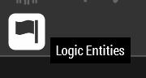

## Adding a dedicated (captive) Zeus slot

A captive Zeus slot has a forced interface, i.e. the player in that slot can
not exit the interface during play. This is entirely distinct from the Zeus
access an admin has (if so configured, which is the case in the template
mission and should be the case for _all_ PA missions).

First, put a "Game Master" module on the map, it doesn't matter where you put
it:

Open its attributes and make sure these four settings look the same as in the
screenshot:

If you want to add multiple Zeus slots, check with `#arma-missionmaking`,
since there are a few caveats to having multiple Zeuses.

Next, switch the asset browser on the right to "Logic Entities":

Then find "Zeus" in the "Virtual Entities" category, and drop it on the map:

**NOTE:** For this object, the location matters. It is the starting location
for the Zeus player, so it's best to place it near the other player's start
location.

Open the attributes of the virtual entity you just placed:

The `Variable Name` must match what you used for `Owner` in the first module
you placed. This is how the slot here and the Zeus module are tied together.

The `Player` setting does not make much of a difference, but `Playable` *must*
be checked. `Role Description` is what is displayed on the slotting screen.

