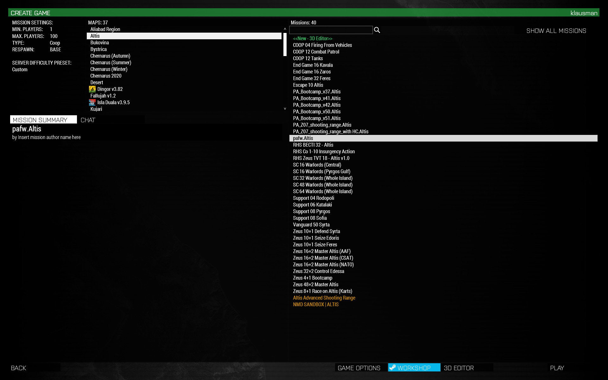

*Note: This guide was originally written by Captain Blaffer and later adapted
to the main PA Arma3 document format by klausman, who also tweaked a few small
items and added links to the rest of the documentation. The original document can be found at: https://docs.google.com/document/d/1srBUe4tHxHP0sC5gSfsGsxe4pQzpkZd-SA328QKA4r4/view#*

In PA we use a mission framework. This is an already made mission for
you to open and edit. Most of the work required to have a functional
mission is already done in this framework. You just have to tweak it and
add some objectives!

Below I will guide you step by step how to make your first mission.

\-Captainblaffer

## Download, unpack and set up the Example Mission and Extra Scripts

1. Download the [PA framework](https://github.com/klausman/pafw/releases)
   (https://github.com/klausman/pafw/releases) 
2. Place downloaded folders in A3 missions folder. 
 Open A3 missions
   folder in explorer. The file path will look something like this:
   `C:\Users\klausman\Documents\Arma 3\mpmissions` 
   *Note:* If the folder MPMissions does not exist, create it. 
   The ZIP will contain a folder named `pafw-0.0.1.zip` or similar. Unpack
   it to the `mpmissions` folder and rename it to `pafw.Altis`:
   
3. Open the A3 mission editor. 
   Start A3 with all of PA’s addons enabled. Then navigate yourself to the
   Multiplayer tab in the main menu. Press ‘Host Server’ and set Host to
   LAN: 
    
   In the next menu, find the framework missions by selecting Altis as map,
   and then selecting *pafw.Altis* in green color. Now press the ‘3D
   Editor’ button on bottom right. You will now load the framework mission
   into the A3 Editor. 
    

## Defining mission rules

I will now explain everything that’s present in the example mission. But before
that, it is better for you to create your own mission first. We will be
creating a copy of the example mission, but you can select whatever
map (Altis, Stratis etc.) you prefer.

To create a new mission:

1. While `pafw.Altis` mission is loaded in the editor, drag your mouse
   over all the objects placed down in the mission so you select them all at
   the same time. It should include modules, markers, units and vehicles.
2. Press CTRL+C on keyboard to copy.
3. On the toolbar at the top left of the screen, select new, select the map you
   desire and name your new mission. Load it up.
4. In your new, empty mission press CTRL+V to paste the previously copied
   objects. Note the objects may be in some weird spot in the corner of the
   map.
5. In windows explorer, open the folder `pafw.Altis.` Select all files
   in that folder except for `mission.sqm`, and copy the files (CTRL+C)
6. In windows explorer open the folder of your new mission, found somewhere in
   `\Documents\Arma 3\mpmissions`

Paste the copied files (CTRL+V). Remember do not overwrite `mission.sqm`.

You have now created a new mission which contains all the PAFW features,
settings, and pre-placed assets. Let’s continue to work on this mission from
now on, so you can keep the pafw.Altis mission unchanged and ready to
be used for future missions.

## Mission rules & info are defined in several places

1. Modules placed in the 3d editor
2. `init.sqf` (found in `\Documents\Arma 3 \MPMissions\missionname.mapname`)
3. `description.ext` (same folder)
4. Slotting Screen Parameters
5. In the editor: Settings > Addon Options

### Modules

Modules you find in the 3d editor asset browser under Systems(F5). There are
some pre-placed modules in the example mission already. Click on them to see
what settings they contain. You are of course free to tweak the settings, but
remember these default settings is what PA is used to, change it too much and
players will be confused.

**Note:** A lot of settings that used to be configure via modules are now CBA
settings (see below). While some modules might still work, they will likely
emit warnings about their deprecation. When in doubt, ask in
`#arma-missionmaking` on Discord.

### `init.sqf`

In `init.sqf` you can enable or disable certain PAFW features, or tweak the
values. You open this file with any text editor. I recommend
[notepad++](https://notepad-plus-plus.org/download/v7.3.3.html) and getting the
[SQF syntax highlighting](http://www.armaholic.com/page.php?id=8680) ‘addon’

The commented text above each block of code should explain what it does.

E.g. you can disable `f_safeStart` by commenting out (`//`) line 62.

### `description.ext`

In `description.ext` you can set the mission’s briefing name, description and
loading image. There are a few other features in here that can be tweaked but
it’s rather advanced and not very necessary, so I’ll leave that up to you to
discover.

Note that the mission’s title for the mission selection screen is defined
somewhere else: In the 3d editor’s toolbar click Attributes > General. When
making an updated version of your mission always update this name.

### Parameters

Parameters are mission settings that can be tweaked in the slotting screen, by
pressing ‘parameters’ button at the top. These parameters are defined in
`description.ext`, starting at line 114. You may tweak the default params as
you desire, or activate features.

A few more notes on specific features:

**Safe start** disables player weapons for the first 5 minutes of a game. It’s
enabled per default.

You can turn it off in-game by opening the map screen and clicking ‘admin’
under ‘briefing’.

You can turn safe start off in init.sqf by commenting out line 62: `[] execVM
"f\safeStart\f\_safeStart.sqf";`

**JIP** aka join in progress allows players who join post mission start to
teleport to their squadmates. You can tweak the settings in init.sqf line 68:
`// SETTING: JIP setup (PA version)`

If you wish to change the time of day or the weather, that is best done in the
mission editor: in the 3d editor, go to toolbar, and click Attributes >
Environment.

Tip: For night time missions, check if the moon is visible, because if
it isn’t, it will be almost pitch black (not fun without NVGs!)

### Addon Options

CBA comes with a framework so module makers can easily add settings to their
mods, without everyone reinventing the wheel and settings being all over the
place. This is especially useful for mods like ACE that have well over a
hundred settings that players and units can tweak. As of mid-2019, most modern
mods use CBA settings, so you should definitely go through the settings to
familiarize yourself with the basic setup. Note that some settings are
enforced on the server and can't be changed by players or mission makers.

The [CBA site](https://github.com/CBATeam/CBA_A3/wiki/CBA-Settings-System) has
a good overview of how the basic Client/Mission/Server settings and overrides
work.

If you have specific questions about a certain setting and what it influences
gameplay-wise, #arma-missionmaking is the place to ask.

## Placing player units

In the framework example mission, most required player units have already been
placed down for you, in all 3 available sides: BLUFOR, OPFOR, INDEPENDENT.

You should use these units for your mission also: Remove the units you don’t
need, copy paste units you need extra of. To keep things simple for yourself,
and making it easier to reuse part of your mission for a next mission, I
recommend to always use BLUFOR for players (exception: TvT missions). If you
want the players to play as CSAT or Russians, we will simply change the BLUFOR
player uniforms and weapons.

Now pay attention, here follows an important rule:

**IMPORTANT:** *Only use the factions NATO, CSAT, AAF, FIA.* Let me explain. In
arma we have sides & factions. Sides are obvious (BLUFOR, OPFOR, Independent,
Civilian). Factions are sub-groups within a side: NATO is a faction within
BLUFOR. PAFW uses factions to figure out who is who. The only factions that
are defined per default are the 4 I just mentioned, so unless you are an
advanced user, only use these factions for ANY units (exception are vehicles,
of course). We will use the `assignGear` script to change the default A3 NATO
soldiers into something more interesting.

Like I said before, we will be using and copy pasting the pre-placed units in
the example mission. This is because besides the correct faction, there are a
few other things that have to be set up properly on a player unit to function
100%. Copy pasting prevents user errors and just makes it easier for you. Let's
look at everything that goes into setting up one unit.

Double click any pre-placed NATO soldier to open its attributes.

- Variable name(e.g. `UnitNATO_A2_AT`): Name that the script code
  can use to find this unit. Not required to set this, except for
  the medics. Medics require a specific name for the specialist
  marker feature to work. E.g. `UnitNATO_CO_M.` You can find or
  change the names in
  `missionname.mapname\f\groupMarkers\f\_setLocalGroupMarkers.sqf`
- Init: Code entered here will run on every machine as they join. We
  use it to trigger two scripts: Group Markers & assignGear.

  `GrpNATO_ASL = group this; ["rat",this] call f_fnc_assignGear;`

  The first part (`GrpNATO_ASL = group this;`) is required for the group
  markers feature. All units within one group must have the same name defined
  here. You can find or change all names in
  `missionname.mapname\f\groupMarkers\f\setLocalGroupMarkers.sqf`
  
  The second part, (`["rat",this] call f_fnc_assignGear;`) calls the assignGear
  script, to change the player uniform and weapons. How to change the gear I’ll
  explain later, for now you must know that the first part of the code, which
  is between quotation marks defines which class this unit will be (`"rat"`).
  That’s the part you want to be changing. You can find the abbreviations on
  the top of this file:
  `missionname.mapname\f\assignGear\f_assignGear\nato.sqf`

  - `Playable`: a tick box to make the unit selectable for players in
    the slotting screen. The ‘player’ box is not used in multiplayer.
  - `Role description`: How the unit will be called in the slotting
    screen
  - Last note: The order of playable units in the slotting screen
    depends on when the unit was created in the editor. First created
    units appear on the top of the list. Tweaking the unit order in
    slotting screen is very annoying, I recommend to just not bother.

Besides units, classic assignGear also interacts with ammo crates and
vehicles. In an ammo crate or vehicle, add this code in its init to fill the
crate with the right gear & ammo types for your custom loadouts.

`["crate_med", this, "blu_f"] call f_fnc_assignGear`

Again change the first part of the code depending on which unit you’re putting
it on. (`crate`, `heli`, `ifv`). In this code though there is an extra variable
added: `"blu_f"`. This is there to tell the gearscript this is a NATO unit.
Make sure it’s always there!

On vehicles, a specific variable name will create a specialist marker on
the vehicle just like with medics. E.g. `VehNato_TH1`. You can find or
change all names in
`missionname.mapname\f\groupMarkers\f\_setLocalGroupMarkers.sqf`

## Changing player loadouts

**NOTE:** There is an [alternative document](../assigngear_primer/) covering
"classic" `assignGear` usage, as well as [a simpler
approach](../simpler_assigngear/). 

We will be working with the file
`missionname.mapname\f\assignGear\f_assignGear_nato.sqf`. Open it in your
favorite text editor.

At first this file will look overwhelming. But once you understand how
it works, it’s a very handy tool to help you work efficiently.

*Lines 5-58* is a list of loadout abbreviations for your convenience: The
variable you enter in each unit’s init to set their loadout. E.g. `["rat",this]
call f_fnc_assignGear;`  `rat` = Rifleman AT

*Lines 60 to 287* are where you define which weapons, ammo and clothes the
units will use. The rifleman AT will be using a carbine, so to change the “rat”
main weapon we must change line 104:

`_carbine = "arifle_MXC_F";` changed to:

`_carbine = "arifle_Mk20_plain_F";`

Pay attention to your spelling here. If you make one typo, the whole script can
break.

How did I get the classname for this different weapon? It’s quite convenient.
In the 3d editor, right click a player unit and press ‘change loadout’. This
opens the virtual arsenal (you can also use the ACE Arsenal, if you prefer).
Dress up your soldier how you would like to see him in the mission: uniform,
vest, helmet, backpack, rifle, scope, etc. When done, press ‘EXPORT’. All
classnames are now copied to your clipboard. In your editor, open a new empty
tab and PASTE the text. Change language to SQF in the toolbar for easier
reading. Now here are all your classnames for the custom loadout you made in
the virtual arsenal. One by one copy the different classnames and paste them in
the correct slots in `f_assignGear_nato.sqf`

Some clothes can have multiple classnames in an array, e.g.

`_baseHelmet = ["H_HelmetB","H_HelmetB_plain_mcamo"];` This will cause the
script to randomly choose one of them. Note that even if you want only one
item, it should still be an array, e.g. `_baseHelmet = ["tinfoil_hat"];`

There are some premade clothing classes made at line 238 - 244. You may change
this for whatever use you need. E.g. if you want all squad leaders to have a
beret, you can add “dc” in the specops array, then change `_sfhelmet` to a
beret.

NVGs, maps, GPS etc are added in lines 321 - 327 for all loadouts. If you don’t
want all loadouts to have a certain item, comment out a line by adding `//` at
the front of a line.

Medical items are added in a different file (ACE3):
`missionname.mapname\f\ace3\ACE3_MedicalStandardClient.sqf`

Radios are added in a different file (TFR):

`missionname.mapname\f\radios\tfr\tfr_settings.sqf`

`missionname.mapname\f\radios\tfr\fn_tfr_addRadios.sqf`

**NOTE:** This has changed with TFAR 1.x, see the [corresponding
document](http://skade.schwarzvogel.de/~klausman/armadoc/mission_making/tfar/)
for details.

Attachments are set at line 77. Most loadouts will receive the default setup
you set here. E.g. don’t want a scope? Change it to this: `_attachments =
[_attach1];`

To change attachments for specific loadouts take a look at line 477, the `dm`
loadout has a custom scope. This brings us to the last part of the gearscript:

*Lines 349 - 1000* is where each loadout is defined. Exactly which weapon they
receive, how many magazines etc. You don’t have to tweak this part, the default
values set are quite ok. But if you want to, here it is.

Backpack inventories work quite the same as defining loadout inventories. But
it's in a different file. Open file: `f_assignGear_nato_b.sqf`

The first you’ll notice is the `_loadout == 0, == 1, ==2` stuff. All backpack
inventories are defined 3 times to support the customize-able backpack sizes.
In PA we literally never use this, so if you want to change backpack
inventories I recommend only changing everything under `_loadout == 1` the
default backpack size.

Changing the inventory should be quite easy, just note the functions used are
different. You can’t directly copy paste code from `f_assignGear_nato.sqf` to
`f_assignGear_nato_b.sqf`.

Remember to save the files when done editing!

## Placing AI opponents

*Note:* This section is out of date while we bring
the extra functionality up to speed with code changes (and quality) with the
main framework

Editor placed AI might appear to be the ‘default’ or ‘normal’ way of placing
your AI opponents, but it is actually the worst thing you can do. Too many AI
active in your mission at once seriously hurts performance in a multiplayer
environment.

Our goal is to limit the amount of active AI as much as possible. We do this
using AI spawn scripts, which only create the AI once players get nearby. You
can find many of such scripts online, but for your convenience I've selected
several scripts myself and included them all in a single mission:
`F3_PA-examplescripts.Altis`. Open it up in the editor to see an example of
each script placed down, plus a short description.

Note if you wish to use scripts from `F3_PA-examplescripts.Altis,` you must
also copy the folders placed in the `F3_PA-examplescripts` mission folder, and
copy `description.ext` and `init.sqf` from `F3\_PA-examplescripts.Altis`

Murk spawn script guide from klausman:

[Murk Howto](../murk/)

And another one from NyteMyre:

https://docs.google.com/document/d/1ofsbiG1mL7bdh1vWbIYE3BzGDZbkhm4MSTzWjtkCuv8/view

## Testing your mission

To make the mission ready to play on the multiplayer server, you must save the
mission as .pbo file. You do this in the editor toolbar menu
> Scenario > Export to multiplayer.

Your file will be saved in this folder:

`C:\Program Files\SteamLibrary\steamapps\common\Arma 3\MPMissions`

The naming convention for our mission files is as follows:

`PA_COxx_missionname_version.mapname`

(For player vs player mission, replace CO with TVT)

E.g. `pa_co46_insurgency_v2.Tanoa`

Upload the .pbo to the server by asking Helperbot for someone to do so.

Ask volunteer(s) to help test.

We also have [a checklist](../checklist/) of items that we have found are easily
overlooked/untested, that then break the mission at event time.

## Getting a timeslot

To get a timeslot for your mission, we recommend sending a DM to Helperbot, and
briefly outlining your mission (which repo (WW2/Event/Test), name, era,
factions, player count). The Event Mods will then get back to you and figure
out a date to host your mission. Note that they *will* ask if you have tested
the mission on-server with others.

There are a few considerations for missions:

- Typically, new mission makers host on Friday or Saturday for a few times
  before getting a Sunday slot.
- Small missions typically happen on Fridays. Small here means either short
  time-wise (<1.5h or so) or with few player slots (<20).
- Recurring missions like Antistasi, or longer series of missions, like Two
  Sierra, also happen on Fridays, to not crowd out the bigger event missions.
- We typically don't reserve dates further than two weeks into the future.

