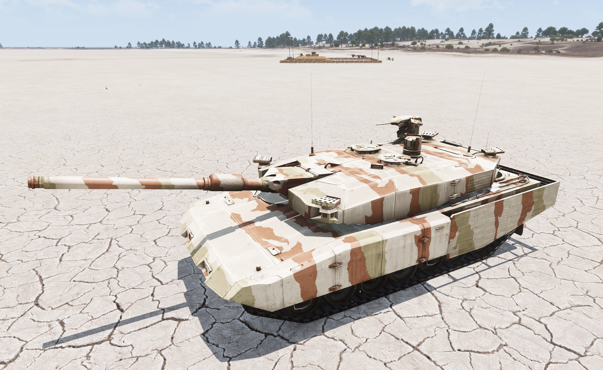
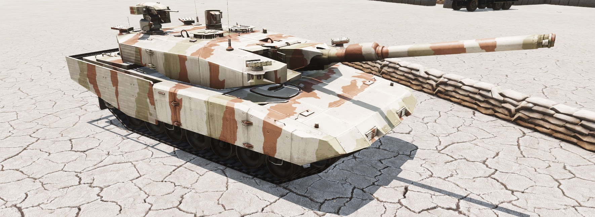
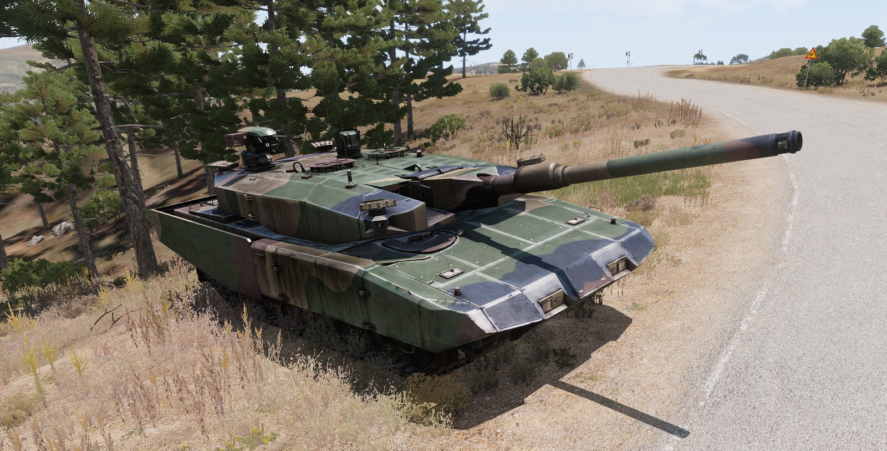
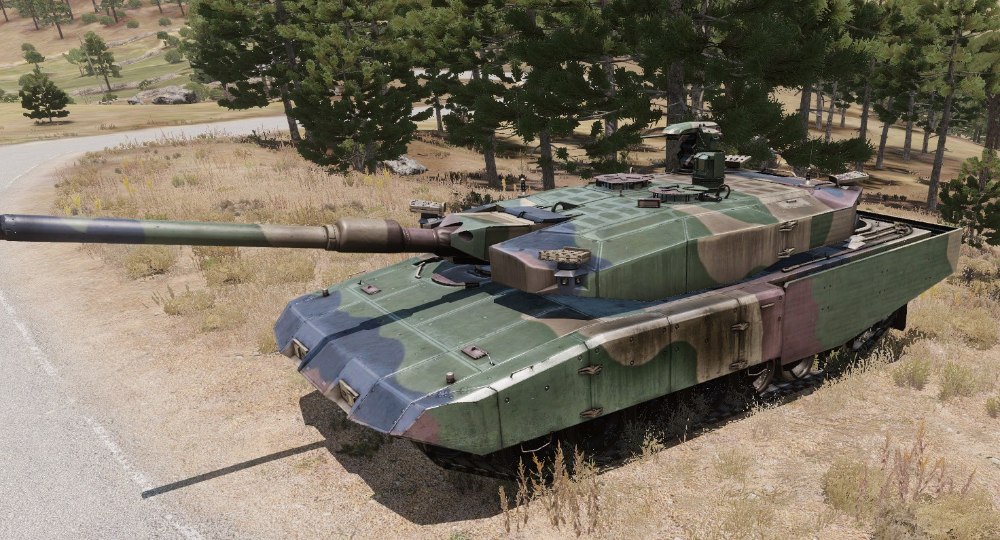

The base game Leopard 2 (2SG aka "Revolution") has only flat textures which
look kinda boring. So here is a set of textures (Woodland and Desert) to make
it look more spiffy.

To use, add this code into a tank's init:

Desert:

```
this setVariable ["BIS_enableRandomization", false];
this setObjectTexture[0, "leo_dsrt_01.paa"];
this setObjectTexture[1, "leo_dsrt_02.paa"];
this setObjectTexture[2, "leo_dsrt_rcws.paa"];
```

Woodland:

```
this setVariable ["BIS_enableRandomization", false];
this setObjectTexture[0, "leo_dsrt_01.paa"];
this setObjectTexture[1, "leo_dsrt_02.paa"];
this setObjectTexture[2, "leo_dsrt_rcws.paa"];
```

Note that the optional camo nets are _not_ retextured.

Files: <a href="leo2_retex.zip">leo2_retex.zip</a>

Screenshots:

<br/>
<br/>
<br/>
<br/>

