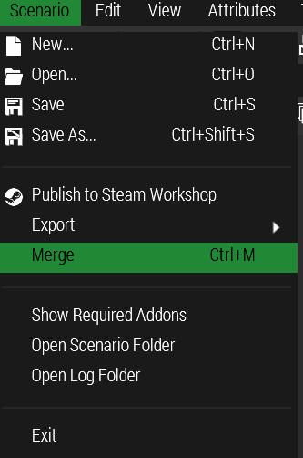

### The basic problem

The missing mods problem most often originates with mods like JSRS and
Blastcore overwriting attributes of vanilla (or other mods') assets. It is
also a problem that comes up when porting old missions from older versions of
our modpack to the current one.

### The old, horrible method of fixing it

Mod dependencies are defined in the `mission.sqm` file that the Editor uses.
There are two sections at the top that define what mods the mission needs. One
can of course edit this file (if it isn't binarized) and remove the
references, but this is error prone and quite a hassle to do right. But with
newer versions of the editor, this method is no longer needed!

### The great new method

So you just opened a mission in the editor and it tells you that stuff is
missing. If you confirm the dialog, you're left with an empty map and
everything sucks. But fret not! Go to the `Scenario` menu and select `Merge`:

Then select the broken mission again, and let Arma inform you that it has
removed all objects that were using the missing mods. And boom, you now have
the old mission working with the new modset. I recommend saving it under a new
name, just so you can still look at the old mission, just in case.

If the old mission was using external files (e.g. our framework), don't forget
to copy them over!

### Caveats

Obviously, if the deps weren't caused by JSRS or similar mods, there are now
things missing. It's up to you to figure out if this a problem for mission
flow, and implement proper fixes.

This method also works with PBO'd missions, if you use [PBO
Manager](http://www.armaholic.com/page.php?id=16369) to extract the files into
an editable directory.
