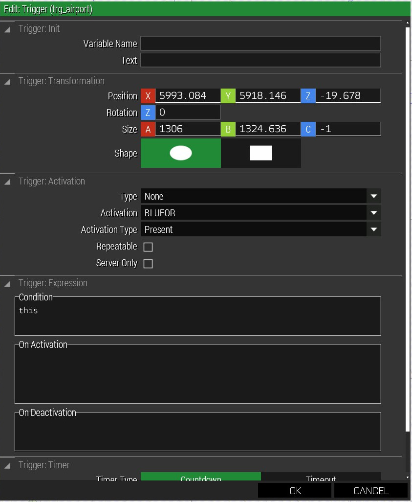

## The what and the why (and a bit of how)

The murk script, as used by PA, was originally written by Murklor and
ArmAIIholic and then improved and changed by various authors, including Wulfy
Wulf and Captainblaffer. Its main purpose is to reduce the performance impact
of missions with a lot of AI units. Contrary to other solutions to this that
work with preset areas and scripted unit makeup, murk allows the mission maker
to pre-place the units and their waypoints just like normal, only needing to
add a few triggers, link them to the units and add a small call to the unit
leader’s init function.

At the start of the mission, murk removes all units placed under its care. This
reduces the amount of time the server has to spend on AI calculations and thus
improves its overall performance. When it does so, it also removes all of the
units' waypoints, storing them and the unit for later use. When one of the
associated triggers is firing, murk spawns the unit in its original place, adds
back the waypoints and (optionally) runs the assignGear function on the units.

Murk will also (optionally) remove dead units and units that are too far away
from the player. The time after death for the former and the distance for the
latter can also be configured per-unit.

Finally, murk can spawn units repeatedly (all members of the group are dead) or
in waves (every N seconds, even if the old group is still alive) or repeatedly
with trigger reset. We will go into more detail on all of these options later.

##  Things you’ll need

To use Murk in the context of the PA framework, you’ll need the murk
subdirectory from the examplescripts mission. You will also need to add a short
snippet to the description.ext of your mission:

```
class MURK  
{  
  class nearPlayerGround  
  {  
    file = "murk";  
    class nearPlayerGround{};  
  };  
};
```

This should go inside the `CfgFunctions` class section of the file. There
already are similar class statements for other parts of the framework, and this
one should be on the same logical/nesting level. If you need help figuring out
the right spot, ask on Discord in #arma-missionmaking and we’ll guide you.

## Basic use of `murk_spawn.sqf`

The basic way to use murk is to place a unit somewhere, optionally add some
waypoints, associate the *group leader* with a trigger, add the murk call to
the leader’s init function and you’re done. We’ll go through this step by step:

1. Place a unit. It doesn’t really matter whether this is a fire
   team, a rifle squad, or a vehicle crew (though vehicles can be
   special, see the section below for details). You can also add
   waypoints normally.
2. Place down a trigger. Usually, you’d want something like this:  
     
   This will trigger every time a BLUFOR unit is inside the trigger
   area. This way you can place down a trigger amongst a group of
   enemy AI, associate all of them with one trigger and make the area
   large enough that the AI spawns just before the players come into
   range. You can also place the trigger on an objective and trigger
   a unit a distance away, with a waypoint on the objective, thus
   simulating a QRF. The Timeout functionality of triggers works
   especially well to make QRFs that only show up ten minutes after
   the shooting starts.
3. Murk-ify the trigger. First you have to give it a name. In my
   example, I use `trg_airport`:  
     
   Then, in the `On Activation` field, add the call to murk:<br/>  
   `triggerName setVariable ["murk_spawn", true, true\];`<br/>
   As seen in the screenshot, `triggerName` should be replaced with the
   trigger name you chose.
4. Sync the group leader with the trigger. This is usually done by right
   clicking the unit leader (not the squad itself!) and selecting “Sync to”,
   then clicking on the trigger. Note that you can have several triggers
   associated with one unit, so the AI gets spawned no matter which direction
   the players approach from, for example.
5. Add the murk code to the unit leader (again, the unit leader, not
   the squad itself). This call has the form:<br/>
   `nul=[unit,gear,spawntype,lives,delay,init,removaltimeout,deletedistance] execVM "murk\murk_spawn.sqf";`<br/>
   Those are lot of parameters. Don’t worry, we’ll look at them one
   by one (and most of the time you don’t need all of them). Here’s
   what they do:
   1. `unit`: the unit to run the murk machinery on. Usually, it’s
      `this`.
   2. `gear`: this is a boolean (`true`/`false`) that determines whether
      `assignGear` should run on this unit.
   3. `spawntype`: how to spawn the units, one of `once`, `repeated`,
      `wave` and `reset`.
       1. `once`: exactly what it says on the tin. Spawn the unit once
          and done.
       2. `repeated`: spawn the unit again after some time (delay
          below), but at most `lives` times. The units only respawn
          after death.
       3. `wave`: spawn the unit again after delay, whether the
          original unit is dead or not. The `lives` parameter works
          just like with `repeated`.
       4. `reset`: reset the trigger after delay seconds (defaults to
          15s) before re-spawning the unit. This can be used to make
          sure the original conditions are still met.
   4. `lives`: the amount of lives for the spawn types that care about
      it
   5. `delay`: delay for respawns in seconds (not the initial spawn\!)
   6. `init`: a custom init string called on the group leader on spawn.
   7. `removaltimeout`: Dead units will be removed after this many
      seconds
   8. `deletedistance`: Units will be deleted if they reach a waypoint
      and are at least this many meters from the players.

I promised that there is a simpler call you would usually make. Murk
fortunately has sensible defaults on most of these variables, so usually, you
only need the first three. Thus:

`nul = [this, true, "once"] execVM "murk\murk_spawn.sqf";`

This is what you’d use most of the time: spawn this particular group once on
trigger activation, and run `assignGear` normally. The actual gear assigned
will be derived from the unit class in the editor. Unless you have exotic gear
setups (or exotic addon units), it should work fine. If the enemies you placed
are fine kit-wise as they are shown in the editor, use `false` as the second
parameter

One thing of note is that Murk does *not* save the stance/pace of the units as
they are placed in the editor. That is, the settings of `COMBAT` or `SAFE` and
the movement speed go back to their defaults when murk removes and then spawns
the unit. The easiest way to get that functionality back is to give the unit a
very close first waypoint that sets the two attributes to the values you need.

Of course, you are not limited to the proximity trigger I outlined above, you
can also spawn units when other units die (using `isAlive`) and anything and
everything else Arma triggers can do.

## Advanced examples

- Spawn the unit a total of five times, waiting twenty seconds after their
  death before spawning them again: <br/>
  `nul = [this, true, "repeated", 4, 20] execVM  "murk\murk_spawn.sqf";`<br/>
  Note that the repeat parameter is `4`, since the original spawn is
  not counted.
- Spawn a group of enemies a total of six times, three minutes apart, no matter
  if older versions are still alive:<br/>
  `nul = [this, true, "wave", 5, 180] execVM "murk\murk_spawn.sqf";`
- If a lot is going on in your mission, you should make sure unneeded units are
  cleaned up quickly. So here's an example where dead units are deleted after a
  minute and units further than 750m from the players are also deleted:<br/>
  `nul = [this,true,"wave",5,180,"",60,750] execVM "murk\murk_spawn.sqf";`<br/>
  The init script is `""`, which does nothing.
- TODO: Add example for "reset"

## Vehicles

Vehicles can be a bit tricky with murk. Usually, vehicles placed with the crew
work fine. If you mix and match vehicles and their crew/passengers from
different factions, sometimes they will disembark on spawn and then run/walk to
their waypoint, which is of course not what you want.

The usual solution is to place the vehicle and the crew/passengers separately,
then give them a waypoint near the vehicle, change its type to `GET IN NEAREST`
and then add subsequent waypoints normally.

Another thing to note is that having two separate units in the same vehicle (or
boarding the same vehicle) can be tricky at best and usually doesn't work well
with Murk. There are other scripts in the PA framework and example mission that
are better at simulating scenario elements like para-dropped QRFs.

## How to use `murk_building.sqf`

There is an additional Murk script intended for units that are in buildings.
These do not use triggers, but instead determine spawning on distance to the
player (since that makes most sense for these semi-static units).

The script does not place units in buildings for you, so you can do that by
hand, or by using one of the Editor Mods that have such functionality.

The basic use of the `murk_building.sqf` script is to put this into the unit
leader's `Init`:

`nul = [this, true, 300] execVM "murk\murk_building.sqf";`

The first two parameters work just like they do for the normal Murk spawn. That
is, they select the unit to be controlled by Murk and whether `assignGear`
should be run on them. The third parameter is the distance in meters from the
players that will trigger a spawn of these units.

There is one optional fourth parameter that controls when the unit will leave
the building and patrol the surrounding area. Specifically, it is the number of
members in the unit at (or below) which the group will leave the building. So
if you have a normal squad (eight soldiers) and set the parameter to 6, they
will leave the building after two of them have been killed. This works well for
units abandoning a position that they don't think is safe, or for making it
look like the alerted AI start searching for the unit that fired upon them.

## Troubleshooting

Unfortunately, Murk's diagnostics aren't all that great. Typically, you will
get errors on mission start that some object is `nil` when it shouldn't be, or
that Murk expected a unit but got a group. The most common are:

- Empty trigger objects: A unit has a murk spawn call in `Init`, but is not
  associated with a trigger object (or the trigger name is empty)
- Expected a unit, got a group: the murk call was placed in the squad's init,
  instead of the leader's.
- An error about `nearPlayerGround`: the snippet from the "What you need"
  section is not in `description.ext`, or in the wrong place.
