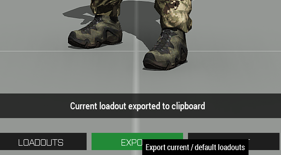
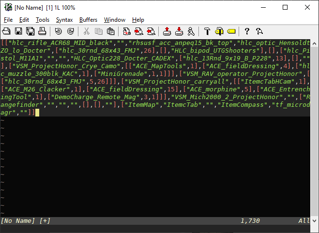
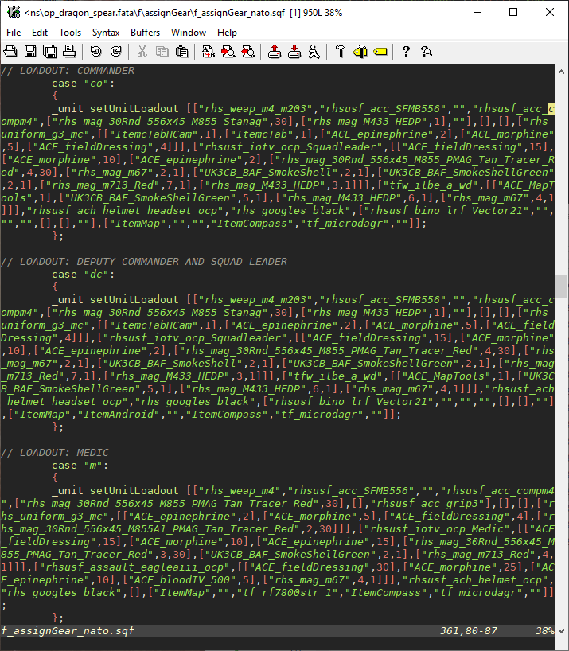

## Introduction

This document describes a simpler (but less powerful) way of using the
`assignGear` functionality in the mission framework PA uses. The main
complaint people have about `assignGear` is that it has many moving
parts, requires precise copy&past of many different classnames, and that
is hard to figure out what's wrong when it breaks. (Though the latter
part is mostly Arma's fault, not that of F3 or `assignGear`.)

The main advantages of `assignGear` are that the player's kit is
consistent between different players of the same role (all ARs get the
same loadout). It is also integrated with out respawn system. Giving the
players the same kit on respawn is *not* trivial: we can't just copy
whatever they had when they died, since they will likely have consumed
ammo, or found medical supplies. Therefore, the "starting loadout" of
the players must be stored somewhere. In the case of F3, that is
`assignGear`.

This guide tries to address the fact that there are a *lot* of variables
to set in the basic `assignGear` script, and it's not always clear what
influences what. On top of that, both radios and medical supplies are
set in different parts of the framework, so in total, the loadout of the
players is set in 4-5 files.

## The fix

Help comes in the form of the ACE arsenal. Not only does it have a
better UI, and the ability to save loadouts, but it also allows us to
export the entirety of a loadout as something we can use in
`assignGear`.

To export the current loadout into your clipboard, click `Export` at the
bottom of the arsenal screen:



Let's take a look at what we actually got there, by pasting it into a
text editor:



That looks entirely unreadable, though we can see e.g. the rifle and the
uniform, plus some items, like map and compass. This is the downside of this
method: editing that nested data structure quickly becomes unwieldy, unless we
just want to delete a few mags or change something obvious.

But it doesn't matter much: we can save loadouts in the ACE arsenal, and
the string we have here happens to be *exactly* what we want to use in
`assignGear`. In the usual script (`f\assignGear\f_assignGar_nato.sqf`
if we're playing as BLUFOR), we pick the role we want to change, e.g.
`co`, `dc`, or `m`, and delete everything between the curly braces, so
it looks like this:

```
    case co:
    {
    };
```

Then we add `_unit setUnitLoadout`, the export string from ACE, and
close the line with a semicolon:



And presto, ready-made loadout. This still doesn't address the medical
and radio inventory situation. We'll get to that below.

## Medical supplies

We don't want to entirely disable the medical init scripts, since they
do more than just set player gear. But we do want to stop them from
messing with their inventory. Fortunately, that is all done in one of
two files, in `f\ace3`, there is `ACE3_MedicalStandardClient.sqf` and
`ACE3_MedicalAdvancedClient.sqf` (be careful to not edit the `Converter`
files that have very similar names.

Just delete the entire *contents* of those two files. **Do not delete
the files themselves.**

## Radios and radio configuration

**NOTE: This part is obsoleted by TFAR 1.x. I will update this section
when I find some time to do so. In the meantime, refer to [the TFAR 1.x
update doc](../../mods/tfar1mm/).**

The radio initialization (what radios to give everyone, but also pre-set
channels and crypto codes) is set in assorted files in `f\radios\tfr`.
We are specifically interested in `fn_tfr_addRadios.sqf`. Around line
15, there is this block:

```
switch ((side player)) do { //longrange, shortrange, rifradio
    case (west): {
      _radio1 = TF_defaultWestBackpack;
      _radio2 = TF_defaultWestPersonalRadio;
      _radio3 = TF_defaultWestRiflemanRadio;};
    case (east): {
      _radio1 = TF_defaultEastBackpack;
      _radio2 = TF_defaultEastPersonalRadio;
      _radio3 = TF_defaultEastRiflemanRadio;};
    default {
      _radio1 = TF_defaultGuerBackpack;
      _radio2 = TF_defaultGuerPersonalRadio;
      _radio3 = TF_defaultGuerRiflemanRadio;};
};
```

We can change the right hand side of the `radio1`-`radio3` assignments
to the classnames of whatever radios we want, for example, for BLUFOR,
change the first block like so:

```
switch ((side player)) do { //longrange, shortrange, rifradio
    case (west): {
      _radio1 = "tfw_ilbe_a_wd";
      _radio2 = "TFAR_anprc152";
      _radio3 = "TFAR_rf7800str";};
    case (east): {
      _radio1 = TF_defaultEastBackpack;
      _radio2 = TF_defaultEastPersonalRadio;
      _radio3 = TF_defaultEastRiflemanRadio;};
    default {
      _radio1 = TF_defaultGuerBackpack;
      _radio2 = TF_defaultGuerPersonalRadio;
      _radio3 = TF_defaultGuerRiflemanRadio;};
};
```

Note that the classnames have to be quoted, since they are classnames,
whereas the `TF_default...` entries were variables.

## Conclusion/Caveats

This approach to `assignGear` has the advantage of being relatively simple when
creating loadouts: click them together in the ACE Arsenal, paste them into the
file, done. It does have downsides, though, in that it's more likely that
inconsistencies creep in, like accidentally giving the riflemen 40mm grenades
they have no weapons for and the like.

Furthermore, `assignGear` goes beyond just setting loadouts at start and on
respawn: it can also be used to set the inventories of vehicles and supply
boxes (note the `v_car` and other classes around line 750 of the `assignGear`
script, as well as the `crate` classes below it). When using the script as
originally intended, the crates/vehicles would have exactly the right equipment
(spare weapons, ammo, supplies) that the players spawned with. In my
experience, PA makes little use of that, so maybe not much is lost.


