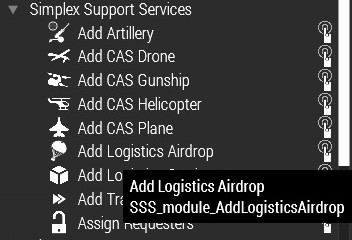
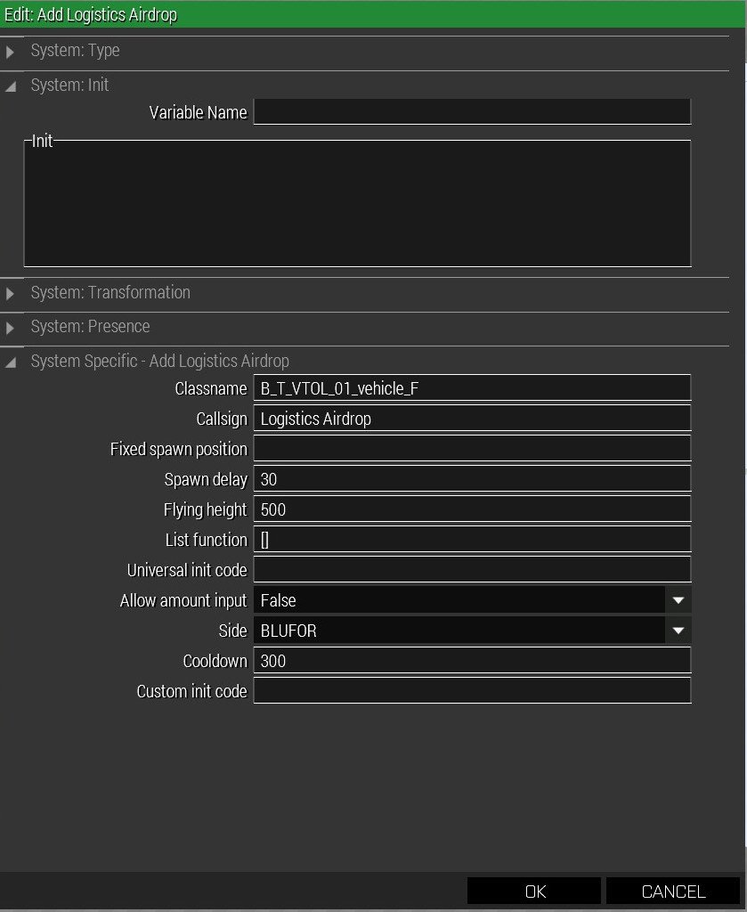

Simplex Support Script has an amazing airdrop module that is easy to use.
However, in its base mode of operations, it takes classnames for the things to
drop, which means that unless you want to drop one of the already-defined
objects in the game, e.g. vehicles or supply boxes, you are out of luck.

This guide describes how to use one of the base boxes (e.g. the standard NATO
Ammo supply box that contains vanilla ammo) and customize its contents. As a
bonus, it also explains how to make the box pop a smoke or chemlight when it
hits the ground.

## The SSS airdrop module

The module can be found in the Modules tab under `Simplex Support Services`:



It has a few interesting attributes:



For this guide, the interesting part is the `List function` field, which has
this tooltip:

```
Code that must return an array of items that can be requested.

0: Classname <STRING>
1: Custom Name <STRING>
2: Custom Icon <STRING>
3: Init code <CODE>
```

For us, the `Init Code` part is the interesting thing: it is called whenever
the boxes are spawned during the airdrop. Thus, we can use it to customize the
box. We can also use the code to add some logic that pops a smoke or drops a
chemlight once the box hits the ground. Arguably, that could also be done
using the `Universal Init` field, but personally, I prefer all logic in one
place (and editing code in a file, as we will be doing, is easier than in the
editor's tiny input boxes).

## Calling our script

The first step is to add code to the `List function` field that will call our
script. I recommend preparing this code in a text editor and keeping the file
around for easier editing. Said text file does not need to live in the mission
folder, just copy and paste between the text editor and the Eden SSS dialog.

The code we want must supply the four parameters mentioned above, for each box
we want. For example:

```cpp
[
  ["Box_NATO_Ammo_F",  // Box Classname
   "Rifle Ammo",       // This is shown to the players when using the SSS menu
   nil,                // Icon in the menu, usually nil
   // The call to our customizing script
   {[_this, "box_r_a"] call compile preprocessFileLineNumbers "pa\sss_airdrops.sqf";}],

  ["Box_NATO_Ammo_F",  // Same box as above
  "AR Ammo",           // Name shown to players
  nil,                 // No icon
  // Almost the same code, see guide for specifics
  {[_this, "box_ar_a"] call compile preprocessFileLineNumbers "pa\sss_airdrops.sqf";}]
]
```

Note how the code called differs in the second parameter passed to the script
(`box_r_a` vs. `box_ar_a`). These names are entirely arbitrary, I just went
for something relatively short that still has meaning (`box` of `r`ifle
`a`mmo etc). You can use any names you want, but they will have to match up
with the script as discussed below.

## The customization (and smoke/chemlight) script.

If you use the code as mentioned above, the custom script should live in the
mission folder, as `pa\sss_airdrops.sqf` and look roughly like this:

```cpp
diag_log format ["SSS: custom airdrop script start"];

_clearbox = {
  params ["_btc"];
  clearItemCargoGlobal _btc;
  clearWeaponCargoGlobal _btc;
  clearMagazineCargoGlobal _btc;
};

_box = _this select 0;
private _boxtype = _this select 1;
diag_log format ["SSS: custom airdrop with box %1, type %2", _box, _boxtype];

// BEGIN Box definitions
switch (_boxtype) do {
  case "box_r_a": {
    [_box] call _clearbox;
    _box addMagazineCargoGlobal ["hlc_31rnd_556x45_EPR_G36", 50];
  };
  case "box_ar_a": {
    [_box] call _clearbox;
    _box addMagazineCargoGlobal ["rhsusf_200Rnd_556x45_soft_pouch", 30];
  };
  default {
    diag_log format ["SSS: Custom aidrop script got unknown box type '%1'", _boxtype];
  };
};
// END Box definitions

diag_log format ["SSS: Custom airdrop spawning smoke "];
[
 {isNull (_this select 0)|| {getPos (_this select 0) select 2 < 2}},  // Condition
 { // Code
  _pos = getpos (_this # 0);
  // Customize smoke or chemlights below
  "UK3CB_BAF_SmokeShellOrange" createVehicle _pos;
  //"ACE_G_Chemlight_HiYellow" createVehicle _pos;
 },
 [_this select 0]] // Params
 call CBA_fnc_waitUntilAndExecute;
diag_log format ["SSS: custom airdrop script complete"];
```

Most of the code can stay as-is. The interesting sections are the
stuff between `BEGIN Box definitions` and `END Box definitions` and the two
lines after line 35 (the ones mentioning `createVehicle`).

The box definitions are relatively simple:

```cpp
  case "box_r_a": {
    [_box] call _clearbox;
    _box addMagazineCargoGlobal ["hlc_31rnd_556x45_EPR_G36", 50];
  };
```

This defines the box `box_r_a` (the string after `case`). The first line uses
a helper function the clear out the entire box contents. The second line than
adds 50 magazines of the type `hlc_31rnd_556x45_EPR_G36`. You can get the
class names from the ACE Arsenal in the usual way.

Note that `addMagazineCargoGlobal` only works for magazines. If you want to
add weapons, use `addWeaponCargoGlobal`; for items, use
`addItemCargoGlobal`. The BIS Wiki has some documentation:

- https://community.bistudio.com/wiki/addMagazineCargoGlobal
- https://community.bistudio.com/wiki/addWeaponCargoGlobal
- https://community.bistudio.com/wiki/addItemCargoGlobal

Naturally, you can use multiple calls to these functions. Also note that they
will allow you to fill the box over capacity.

## Smoke and ~~mirrors~~ chemlights

The last bit of customization is the popped smoke/chemlight. This is entirely
optional, but especially for smaller boxes in terrain with lots of vegetation,
it is extremely useful.

The smoke is spawned with a line like this:

```cpp
"UK3CB_BAF_SmokeShellOrange" createVehicle _pos;
```

or, for a chemlight:

```cpp
"ACE_G_Chemlight_HiYellow" createVehicle _pos;
```

Note that the class names are *not necessarily* the ones you would see in the
Arsenal. A grenade in your inventory is a different object type than one that
has been thrown. When in doubt, ask in #arma-missionmaking for help with
finding the right class names.

### Mixed logistics support

If you want both classnames and customized boxes in the same logistics menu,
you can add them to the code we discussed at the beginning, e.g.:

```cpp
[
 ["Box_NATO_Ammo_F", "Rifle Ammo", nil, {[_this, "box_r_a"] call compile preprocessFileLineNumbers "pa\sss_airdrops.sqf";}],
 ["Box_NATO_Ammo_F", "AR Ammo", nil, {[_this, "box_ar_a"] call compile preprocessFileLineNumbers "pa\sss_airdrops.sqf";}],
 "UK3CB_BAF_LandRover_Hard_Green_A"
]
```

The third item in the list will allow the players to have a Land Rover
airdropped in. 

### Smoke and chemlights for non-boxes

Usually, smoke and chemlights only make sense for boxes, but what if you
wanted to add them to the Land Rover mentioned above? Simple, just pretend
it's a box:

```cpp
[
 ["UK3CB_BAF_LandRover_Hard_Green_A", "Smoked Land Rover", nil, {[_this, "landrover"] call compile preprocessFileLineNumbers "pa\sss_airdrops.sqf";}]
]
```

The next part is optional, but it neatens up things. Add this "box" to the
script:

```cpp
case "landrover": {
   [_box] call _clearbox; // empty the LR inventory
   // Add back stuff here if you want, works the same way as boxes
};
```

### Appendix: Super Advanced Stuff&trade;

Arguably, this approach, while flexible, is still complicated. In an ideal
world, we'd just specify box name and contents somewhere and be done with it.
This is actually possible: the `List function` field doesn't have to be a list,
it could be a call to a scripted function that *returns* a list.

Such a script could read a simple\(r\) file and provide all the needed data,
without much duplication of code and names, thus being more robust. I am
planning on writing this, but it will take time.
