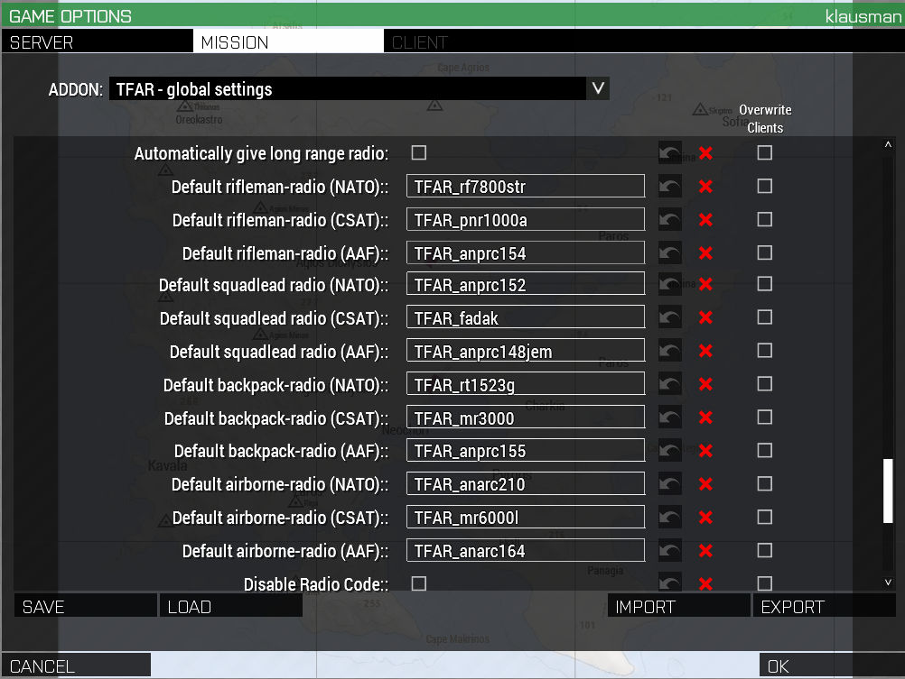
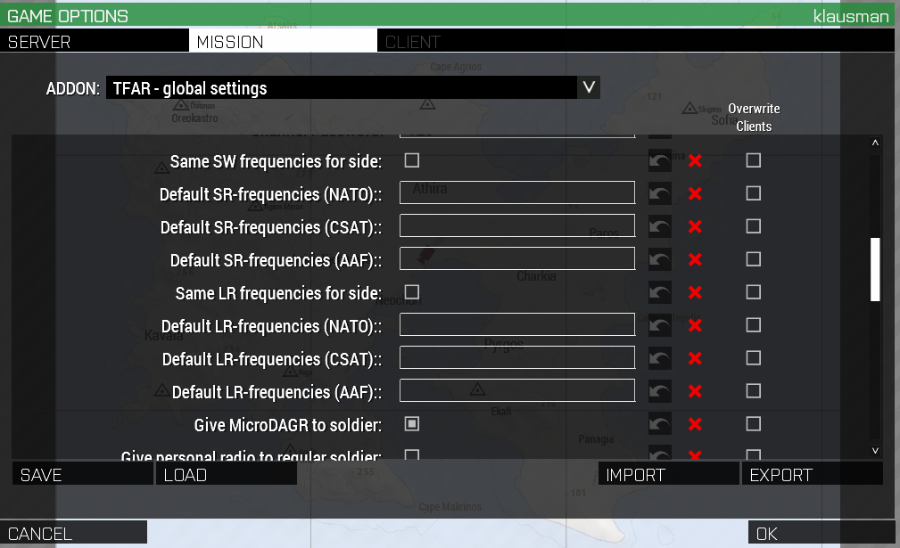

## Introduction

TFAR is a complex mod when it comes to setup, especially when combined with
`assignGear`. This guide should illustrate the steps to follow when using TFAR
and `assignGear` (both variants) together.

First we look at how `assignGear` and TFAR are st up in general, and then at
the bottom are two sections explaining how this relates to using classic
and simplified `assignGear`.

## TFAR and `assignGear` in general

In classic `assignGear`, the radios are distributed the usual way (as with TFAR
0.9), by having the framework call `f\radios\radio_init.sqf` from `init.sqf`.
This script then calls `f\radios\tfr\tfr_init.sqf`, which uses the settings
from `tfr_settings.sqf` in the same directory.

*However,* since these settings are now available in-editor (as of TFAR 1.0),
almost all the settings file are irrelevant (then LR radio setup for this case
is setup there: whether all leaders should get LRRs, and a list of unit types
that will always get LRRs, whether they are leaders or not):

```
f_radios_settings_tfr_defaultLRBackpacks = false;
f_radios_settings_tfr_backpackradios = ["co", "dc"];
```

In the same directory, there is a file called `tfr_serverInit.sqf`, which used
to be the easiest place to change what radio backpacks and individual radios
people would get. First, it sets a few variables to use the *default radios as
defined by TFAR* (this will be important in a moment):

```
switch ((side player)) do { //longrange, shortrange, rifradio
    case (west): {
      _radio1 = TFAR_DefaultRadio_Backpack_West;
      _radio2 = TFAR_DefaultRadio_Personal_West;
      _radio3 = TFAR_DefaultRadio_Rifleman_West;};
    case (east): {
      _radio1 = TFAR_DefaultRadio_Backpack_East;
      _radio2 = TFAR_DefaultRadio_Personal_East;
      _radio3 = TFAR_DefaultRadio_Rifleman_East;};
    default {
      _radio1 = TFAR_DefaultRadio_Backpack_Independent;
      _radio2 = TFAR_DefaultRadio_Personal_Independent;
      _radio3 = TFAR_DefaultRadio_Rifleman_Independent;};
};
```

Note how it doesn't have any actuall class names, but uses variables defined
and owned by TFAR to set some local variables (`_radio1` etc.). It then uses
these variables and the unit types (as defined by their `Init` calls to
`assignGear` to decide who gets what:

```
if(_typeOfUnit != "NIL") then {
   // Set the list of units that get a rifleman's radio
   _rifradio = ["ar","aar","rat","samag","mmgag","hmgag","matag","hatag","mtrag","sp","r","car","smg","gren","dm"];

   // Set the list of units that get a shortrange radio
   _shortrange = ["co", "dc", "ftl", "m", "samg", "mmgg", "matg", "sn", "mtrg"];

   // Give out respective radios

   if (_typeOfUnit in _rifradio) then {
     _unit linkItem _radio3;
   } else {
     if (_typeOfUnit in _shortrange) then {
       _unit linkItem _radio2;
     };
   };

```

Further down, it does similar things for the long-range radios:

```
    if (_unit == (leader (group _unit))) then {
       _backpackItems = backpackItems player;
       removeBackpack _unit;
       _unit addBackpack _radio1;
       {player addItemToBackpack _x;} forEach _backpackItems;
     };
```

There is some surrounding code that checks the settings in `tfr_settings.sqf`
to decide the LR radio handout.

### How to set radio types with classic `assignGear`

As you can see, none of the files mentions classnames, and aside from binary
choice regarding LR radios for roles, there is nothing useful to edit.

So where do we set the radio types (and set up the default frequencies)? The
answer is: in the editor. Since TFAR 1.x, there are CBA-based settings
accsible from the editor that let us choose which radios go where (and
assorted other stuff). The relevant settings look like this (Settings > Addon
Options > Mission Tab > TFAR - global settings):



Here, the actual classnames that then become the TFAR variables like
`TFAR_DefaultRadio_Backpack_West` are set. Naturally, you can also use other
mod radios (like the TFW ILBE radios) here. Make sure to tick "Overwrite
Clients" for the relevant lines if you do so.

*Note:* There is a setting here that says "Automatically give long range
radio". This is basically the same as the setting
`f_radios_settings_tfr_defaultLRBackpacks` from F3, so you best leave it
*off,* to avoid F3 and TFAR fighting over matters.

Frequencies are setup in the same dialog:



*Note 1*: If the fields are empty, the radio frequences will be random. A
typical value for the SR frequencies would be a comma-separated list of
nine frequencies, e.g. `31,32,33,34,35,36,37,38,39`.

*Note 2*: if you do set the frequencies here, make sure to *both* tick the
relevant "Overwrite clients" boxes, as well as the "Same SW/LR frequencies for
side" boxes.

### How to set radio types with simplified `assignGear`

With simplified `assignGear`, things are, well, simpler: just pick the radios
on the normal ACE Arsenal screens and use them as described in the [simplified
`assignGear` document.](../simpler_assigngear/)

The frequencies are set exactly the same way here as for classic `assignGear`:
set them in the dialog shown above, as a comma-separated list of nine
frequencies.
