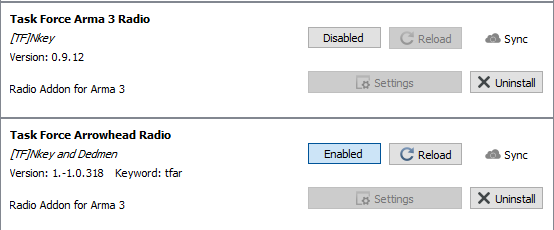

## Disabling TFAR 0.9 and TFAR Animations

First, we will have to disable TFAR 0.9 and the TFAR Animations mod. Open
Teamspeak, go to Tools -> Options, then select the Addons tab. You will see
this entry:

Click on the `Enabled` button disable the plugin (yay, logical UIs!), and the
entry should change to this:

Close Teamspeak.

- *If you are using Swifty 3,* open the main Swifty options and click on
  `Cleanup`. It will probably list a bunch of stuff. Tick *only* the
  TFAR Animations mod if it's there. Then the red `Clean up` button.
- *If you are using Swifty 2,* go to the Swifty download folder(s) and
  manually delete the `@task_force_radion_animations` folder.

## Installing TFAR 1.x

Still in Swifty sync with the repos (both Event and WW2) and go the settings of
both repos, and make sure that there is *no* TFAR Animations mod listed. There
should only be `@task_force_radio`. Also check this in the `External Addons`
tab.

Go to wherever Swifty downloads your mods to and find the `@task_force_radio`
folder. Inside, there should be a `teamspeak` folder, containing
`task_force_radio.ts3_plugin`. Double click it. It will ask you to confirm
installation of the TFAR-TS plugin. Once you have done that, open Teamspeak
again and navigate to the Addons tab as before. There should now be this
entry:

You can keep the old (0.9) plugin for now, but you must keep it disabled.
Turning on both versions will a) not work and b) likely crash your Teamspeak.
This is the state that we want:

After we have used TFAR 1.x for a while, feel free to delete the old plugin.

## New features in TFAR

### Vehicle Intercom

Some vehicles, e.g. the Merkava and the Chinook, now have an internal
communications (intercom) system. Basically an always-on radio chat between
the people on the same circuit. Vehicles typically have 2-5 circuits for
different groups, e.g. Crew, Cargo Handlers, and Misc 1-3. The main use is to
make conversations possible without having to fiddle with radio frequencies or
volume settings.

Typically, the infantry in a heli would pick a Misc channel per squad, and the
Crew/Pilots would pick one to talk amongst themselves, with squad leads/CO
either using the normal LR radios or switching circuits as needed.

*Don't yell at the crew through the intercom, it is rude and will not make
anything better.*

### Stereo settings via ACE

ACE self-interaction now has options for setting up stereo mode and speakers
on/off for both SR and LR radios.

### Headset lowering

Also through ACE interact, you can lower your headset for volume attenuation,
should the chatter become too much.
