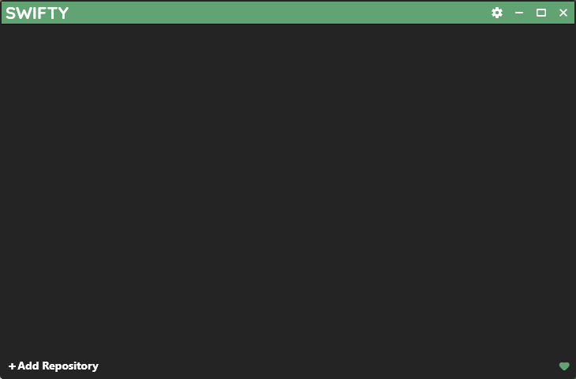
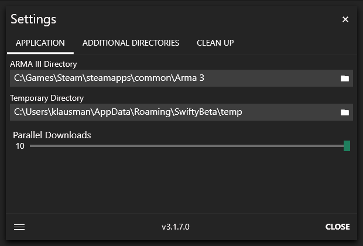
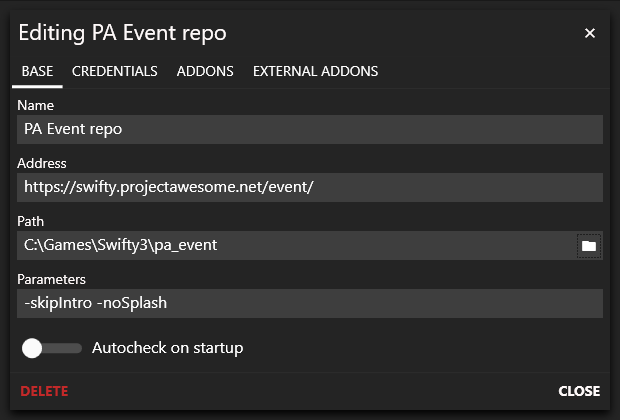
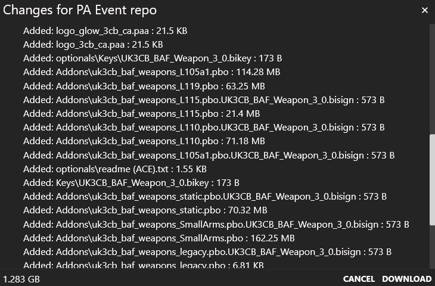
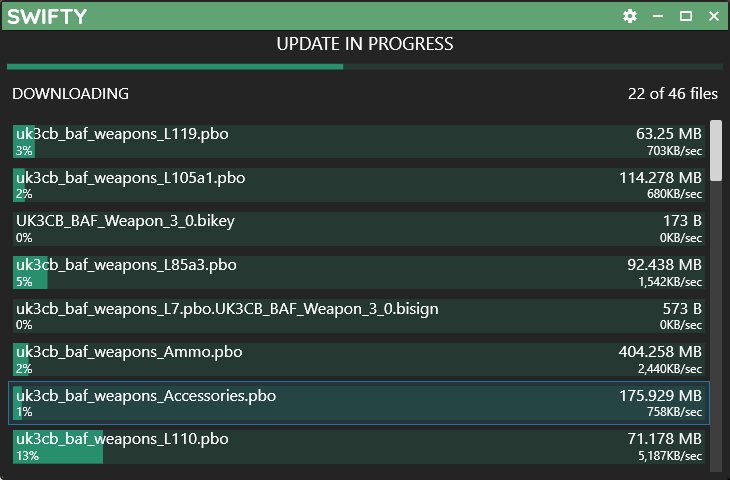

## Introduction

This guide explains how to download and install Swifty, set up the mod pack
downloads, and use Swifty to launch Arma for both playing with PA and editing
missions. It also covers how to use add-on (non-modpack) mods that are
client-side only.

## What is Swifty and why do we use it?

Swifty is a tool that has two main functions: downloading our modpacks, and
launching Arma 3 for you, using those modpacks. The former part goes beyond
what a simple download of a ZIP or PBO file could do, in that Swifty
understands the structure of PBO files (the packaging format of Arma 3), so if
a mod is updated, but only a few files inside the PBO changed, Swifty will
only download the changed files, saving time and bandwidth. This does not come
without downsides: Swifty 2.x had problems with obfuscated PBOs (like the 3CB
mods), but there was a workaround. Swifty 3 has a similar-yet-different
problem: the Faces Of War mod (used in the WW2 modpack) has enormous PBO
files, which slow down the Check phase considerably (minutes!). For now, there
is no easy workaround.

The launching side of Swifty just instructs Arma to load the very mods it
downloaded for you, in similar functionality to the normal Arma 3 launcher. On
top of launching the game for you, Swifty also knows what server to connect to
(and the server password) when playing with PA. Naturally, you can also just
launch Arma with the modpack for editing missions.

## Installing Swifty

Download Swifty 3 from [their website](https://getswifty.net) and install it.
It will install to your user's homedirector (`AppData\Local`, specifically)
and put a shortcut on your desktop. After launching it, you'll get this
screen:

Click on the gear icon at the top right to tweak a few settings. 

Swifty will use the temporary directory to download the differences between
the modpack and the mods you already have, so ideally it should reside on the
same drive as the directories to store the mods. Note that the mods don't need
to be on the same drive as Arma, and that you can freely pick their storage
directories per-pack when we later add the individual modpacks.

TODO: Add'l mod dirs

The concurrent download slider should typically set to 5 or so, higher if you
have a fast internet connection and an SSD.

WARNING: There is a cleanup section in Swifty. At the time of this writing
(June 2019), the functionality there is buggy in that it may delete mods that
you actually need, so we advise to not use it for the time being.

## Adding the modpack(s)

The so-called Event modpack (also called the Event repo) is likely the first
modpack you want to download. It's definitely on the bigger side (~47G), so
this will take some time.

The URLs for the modpacks are:

- Event: `https://swifty.projectawesome.net/docs/swifty/swifty3/`
- WW2: `https://swifty.projectawesome.net/docs/swifty/ww6/`
- Test Repo: `https://swifty.projectawesome.net/docs/swifty/test/`

The next screen should look roughly like this:

Most of the fields will work just fine with their defaults, with two
exceptions: `Path` and `Autocheck on startup`.

The Path is something you must pick. As mentioned above, it's best if the temp
dir in the main configuration and this path are on the same drive, though it
is not a hard requirement. Swifty will store all the mods for this modpack in
that directory, so having plenty of space is recommended. Moving it later is
possible but a bit of a hassle. Note that while I have configured it to live
close the the other games I have, that also isn't a requirement.

Another matter about the `Path` setting is that it is *not* recommended to
share this directory between different modpacks/repos. They tend to stomp on
each other's file, causing frequent re-downloads and other stranger issues.

I typically recommend to disable `Autocheck on startup`, since that operation
can take a long time, and we don't have updates all that frequently.
Typically, modpack updates will be announced on Discord and Reddit, so you can
always manually sync when it happens.

The other tabs (`Credentials`, `Addons` and `External Addons`) don't need to
be touched for now.

Once you close the `Editing...` dialog, you will have a new repo. If you
disabled `Autocheck`, you can click on the new tile and it will do a manual
check. This will prepare some local files (this can take a minute) and then
tell you you need to update the pack.

If you click on the tile again, you will seen information window like this,
where you can see what files changed per-mod:

Click `Update` and off it goes:

After everything is downloaded, Swifty will do some patching (this again take
a minute or so), and you're good to go. Note how the background image of the
tile has changed to the PA logo. If you now click `Play`, Swifty will load
Arma with the modpack and directly connect to the server. If you want to do
mission editing, or play around in the Virtual Arsenal, you can click the
dropdown arrow on the right and click `Launch` instead, which will just load
arma with the modpack, but not connect to the server.

### Possible errors

We have a [separate document](../swifty_trblsht/) describing how to
troubleshoot common Swifty errors.

### Installing the TFAR plugin

**IMPORTANT NOTE:** If you have the older (<=0.9) version of the TFAR teamspeak
plugin installed, use [the upgrade guide](../../mods/tfar_update/). If
this is a from-scratch install, continue here.

Go to wherever you downloaded the modpack to (in my case, that would be
`C:\Games\Swifty3\pa_event\`) and find the `@task_force_radio` folder. Inside,
there is a folder called `teamspeak`, which in turn contains the TS plugin.
Double-click on it and confirm installation of the plugin. To activate the
plugin, you may have to restart Teamspeak.

## External Addons

You can add client-side mods like additional compositions for Zeus, or
client-side sound mods like JSRS or Blastcore to the loaded mods. To do that,
add the directory with the additional mods in the main settings:

You can then tick the external addons in the settings of an individual
modpack:

NOTE: When editing missions, it can happen that these addtional mods create
spurious dependencies (at least JSRS and Blastcore are know to do so). The
easiest way to handle this is to have two separate tiles in Swifty's menu, one
for playing one for editing. You can of course use the same mod dir, so you
don't have duplicate mods. For example, my Swifty 3 main window looks like
this:

